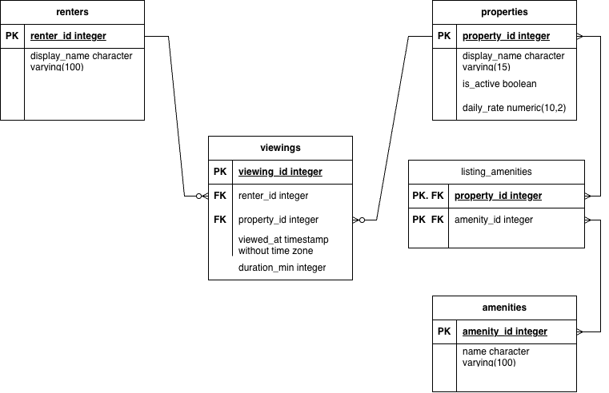

# Cargo Van Rental Marketplace Database Creation
**Philip Morales.** \
**Project Title:** Rental Marketplace. \
**Database Used:** PostgreSQL with pgAdmin
Proper ERD platform Used: drawio

This project models a relational database for a last mile cargo van rental marketplace that tracks the following items; renters (customer who is going to browse the vehicles to rent), properties (Cargo vans - make & model), viewings (Cargo van availability or listings available), amenities (Cargo van features & equipment), listing_amenities (Junction table - MtM of amenities to vehicle listing), and duration_min (How long a customer view a particular Cargo van on site), which are all part of a property within the marketplace. 

**Theme:** Rental Marketplace

**Domain**\
The cargo van rental marketplace is where any customers (renters) is able to view all cargo van listing from Ford Transit 150 or 250 and Ram Promasters cargo van from 1500, 2500, and 3500 sizes. The customers is able to explore vehicle listings on site, compare daily rates for each vehicle, and review all possible amenities such as high roofs (depending on sizes), cargo shelves, vehicle safety cameras, interior lights, and any other features available.  The properties table are the cargo van listings for the site.  The amenities table is for all the features available to the site.   

This project records all vehicle viewing done by customers (renters) on the site.  Each renters is able to look through what vehicles are being listed and which ones are available to rent.  Additionally, each customers (renter) is able to see which vehicle is active and available, as some vehicle may be inactive and not available to due to preventative maintenance, mechanical issues or body shop.  These latter items we did not put into the database or use.  All viewing of vehicles within the database is recorded by the utilization of duration_min metric.  This allows for measurement of customer (renters) interest in which vehicle they are looking to rent from our database.  The equivalent of this is bounce rate per vehicle listing measured in minutes. Lastly, even if a vehicle is inactive we kept the vehicle data and did not delete due to its on viewing minutes for historical data. 

The questions the database answers are as follows; which vehicles are active and which are inactive per each listing on the site, it will also show the daily rate for each vehicle being rented, which customers viewed which vehicles, also how long they viewed a particular vehicle.  The database also mentions all amenities each vehicle may have or may not have.  The important part is the viewing history per vehicle by duration_min recorded to see which is more popular than the other.  

